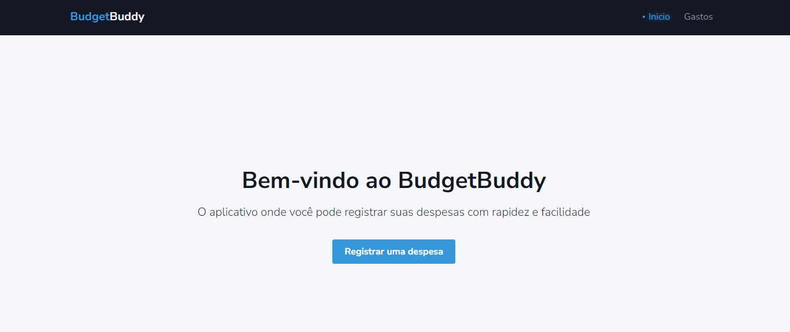
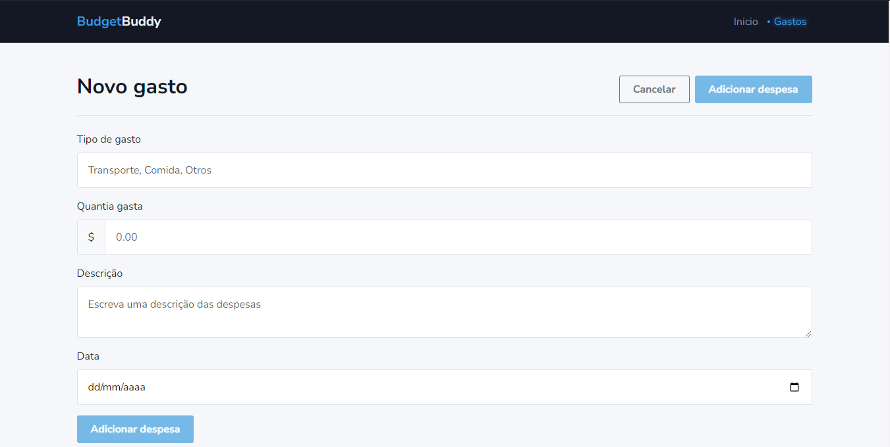

# BudgetBuddyApp



This project was generated with [Angular CLI](https://github.com/angular/angular-cli) version 16.2.12.


## 🚀 Começando

Essas instruções permitirão que você obtenha uma cópia do projeto em operação na sua máquina local para fins de desenvolvimento e teste.

### 📋 Pré-requisitos
Before you begin, ensure you have the following installed:

Node.js (version 16 or higher)
npm (Node Package Manager, usually installed with Node.js)

### 🔧 Instalação

Uma série de exemplos passo-a-passo que informam o que você deve executar para ter um ambiente de desenvolvimento em execução.

Clone the repository:
```
git clone https://github.com/bfrjunior/budget-buddy-app.git
```

Navigate to the project directory:

```
cd budget-buddy-app
```
Install dependencies:

```
npm install
```
Development server
Run ng serve for a dev server. Navigate to http://localhost:4200/. The app will automatically reload if you change any of the source files.


## 🛠️ Construído com

* [Angular 17]()
* [NodeJs]()
